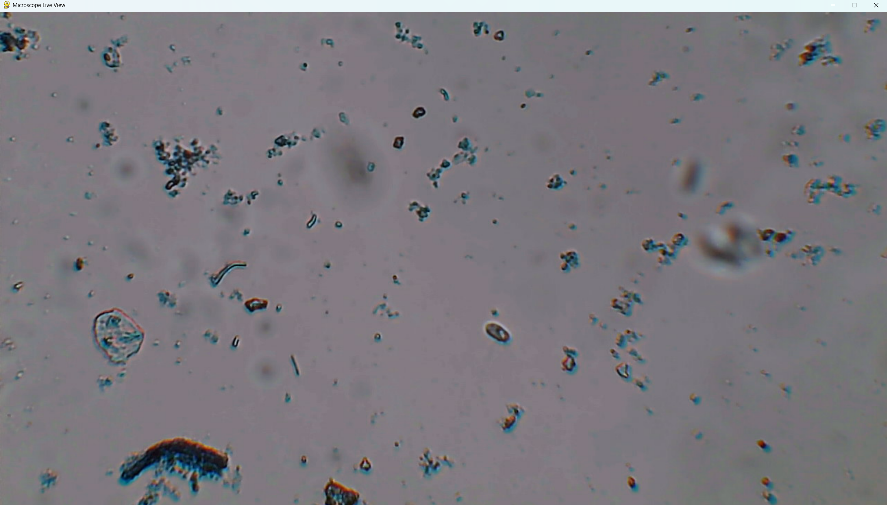

# ScopeView

ScopeView is a live viewer and raw capture toolkit for the **MikrOkularHD** USB microscope (or any DirectShow-compatible camera) on Windows 10/11. Uses OpenCV for capture with pygame (default) or OpenCV windows for display.



_The preview image is illustrative. Replace it with a real capture from your device if you want a true screenshot._

## Features

- Auto-detects MikrOkularHD by name (with a manual `--device` override).
- DirectShow device listing via `--list-devices`.
- Selectable display backend (pygame default, OpenCV optional).
- Configurable resolution/FPS plus FOURCC fallback handling.
- Raw frame dump CLI with optional JSON metadata.

## Requirements

- Windows 10/11.
- Python 3.9+.
- A USB microscope or camera connected to the PC.

## Quick start (Windows)

Open PowerShell or Command Prompt in the project folder:

```powershell
py -m venv .venv
.\.venv\Scripts\activate
pip install --upgrade pip
pip install -r requirements.txt
```

## List devices

```powershell
python microscope_viewer.py --list-devices
```

Example output:

```
[0] MikrOkularHD
[1] USB Camera
```

## Run the viewer

```powershell
python microscope_viewer.py
```

Useful options:

- `--device 0` - use a specific camera index.
- `--device "MikrOkularHD"` - select by name substring (use `--list-devices`).
- `--width 1280 --height 720 --fps 30` - request a specific capture mode.
- `--window-title "Microscope"` - change the preview window caption.
- `--window-width 1280 --window-height 720` - override the preview window size.
- `--display-backend opencv` - fall back to OpenCV's native window; pygame is default.
- `--capture-backend dshow` - force DirectShow (use `msmf` if dshow misbehaves).
- `--capture-backend pygrabber` - use DirectShow via pygrabber if OpenCV backends fail.
- `--fourcc MJPG --fallback-fourcc YUYV` - control pixel formats (`--fourcc auto` to skip forcing).
- `--max-empty 120 --max-reconnects 10` - adjust the watchdog reconnect behavior.
- `--buffer-count 4` - request a specific capture buffer depth.

Quit the preview with `q` or `Esc`.

## Raw frame capture

Capture raw frames for debugging or offline processing:

```powershell
python microscope_raw_dump.py --device 0 --frames 10 --output frame.raw --metadata frame.json
```

Use `--output -` to stream the raw bytes to stdout.

## Troubleshooting

| Symptom | Fix |
| --- | --- |
| No devices listed | Close other camera apps, confirm the microscope appears in Device Manager, then retry `--list-devices`. |
| `Failed to open the camera` | Try `--device 0` or a different index, switch backends with `--capture-backend dshow` / `msmf`, or use `--capture-backend pygrabber`. |
| `backend ... can't be used to capture by index` | Use `--device "MikrOkularHD"` (name substring) or `--capture-backend pygrabber`. |
| Black or frozen preview | Switch pixel formats with `--fourcc MJPG --fallback-fourcc YUYV` and reduce resolution. |
| High latency | Prefer `--capture-backend dshow` and reduce resolution/FPS. |

## Project layout

- `microscope_viewer.py` - interactive viewer that configures capture settings and renders frames.
- `microscope_raw_dump.py` - non-interactive CLI that dumps raw frames plus optional JSON metadata.
- `microscope_devices.py` - device enumeration helpers.
- `microscope_capture.py` - capture helpers with a DirectShow fallback for Windows.
- `docs/screenshot.png` - illustrative preview image.

## License

MIT License. See `LICENSE`.
