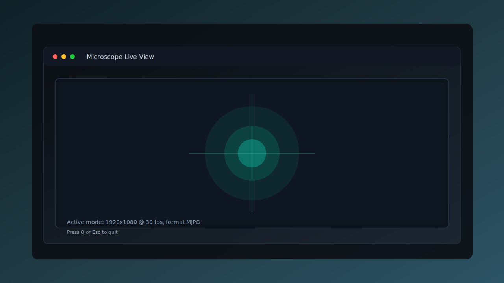

# WSL Microscope Viewer

Live viewer and raw capture utilities for the **MikrOkularHD** USB microscope (or any V4L2 camera) on WSL2/Linux. Uses OpenCV for capture with pygame (default) or OpenCV windows for display.



_The preview image is illustrative. Replace it with a real capture from your device if you want a true screenshot._

## Features

- Auto-detects MikrOkularHD via `/dev/v4l/by-id` with a manual `--device` override.
- Selectable display backend (pygame default, OpenCV optional).
- Configurable resolution/FPS plus FOURCC fallback handling.
- Raw frame dump CLI with optional JSON metadata.

## Requirements

- Windows 10/11 with **WSLg** (or another X/Wayland server) for GUI output.
- WSL2 kernel with UVC support (tested on `6.6.87.2-microsoft-standard-WSL2`).
- [`usbipd-win`](https://github.com/dorssel/usbipd-win/releases/latest) installed on the Windows host.
- Python 3.9+ in WSL.

## Quick start (WSL2)

```bash
sudo apt update
sudo apt install -y python3-venv usbutils v4l-utils linux-tools-virtual linux-cloud-tools-virtual

python3 -m venv .venv
. .venv/bin/activate
pip install --upgrade pip
pip install -r requirements.txt

# Allow your user to access /dev/video*
sudo usermod -aG video "$USER"
newgrp video  # or open a new terminal afterwards
```

## Attach the camera from Windows

Run these commands in an **elevated PowerShell** on the host:

```powershell
# 1. Find the bus ID
usbipd list

# 2. Bind (admin only, once per boot)
usbipd bind --busid <BUS-ID>

# 3. Attach to WSL2 (re-run after every USB reconnect)
usbipd attach --wsl --busid <BUS-ID>
```

Confirm the device is visible in WSL:

```bash
lsusb
# Bus 001 Device 002: ID 058f:3822 Alcor Micro Corp. MikrOkularHD

ls -l /dev/video*
# /dev/video0, /dev/video1, /dev/media0
```

If `/dev/video*` does not appear, ensure modules are loaded:

```bash
sudo modprobe vhci-hcd   # provides the USB/IP host controller
sudo modprobe uvcvideo   # USB Video Class driver
```

## Run the viewer

```bash
. .venv/bin/activate
python microscope_viewer.py
```

Useful options:

- `--device /dev/video1` - manually point to the camera if auto-detection fails.
- `--width 1280 --height 720 --fps 30` - request a specific capture mode.
- `--window-title "Microscope"` - change the preview window caption.
- `--window-width 1280 --window-height 720` - override the preview window size.
- `--window-x 50 --window-y 50` - force a specific window position if WSLg spawns off-screen.
- `--display-backend opencv` - fall back to OpenCV's native window; `pygame` is default.
- `--fourcc MJPG --fallback-fourcc YUYV` - control pixel formats (`--fourcc auto` to skip forcing).
- `--max-empty 120 --max-reconnects 10` - adjust the watchdog reconnect behavior.
- `--buffer-count 4` - request a specific V4L buffer queue depth.

Quit the preview with `q` or `Esc`.

## Raw frame capture

Capture raw frames for debugging or offline processing:

```bash
. .venv/bin/activate
python microscope_raw_dump.py --frames 10 --output frame.raw --metadata frame.json
```

Use `--output -` to stream the raw bytes to stdout.

## Troubleshooting

| Symptom | Fix |
| --- | --- |
| `ls: cannot access '/dev/video*'` | Reattach the device (`usbipd attach ...`) and reload `vhci-hcd`. |
| `Failed to open the camera` | The device is still owned by Windows or another app. Stop any Windows capture software and reattach. |
| `Permission denied` on `/dev/video0` | Ensure your WSL user is in the `video` group and reopen the shell. |
| Window never appears | Confirm WSLg is running (on Windows 11) or that an X server is configured (`echo $DISPLAY`). |
| Window icon shows but no content | Use the default `pygame` backend and ensure `QT_QPA_PLATFORM=xcb` / `SDL_VIDEODRIVER=x11` are set for OpenCV windows. |
| `Corrupt JPEG data` spam / timeouts | Switch formats with `--fourcc MJPG --fallback-fourcc YUYV` or reduce resolution. |

## Project layout

- `microscope_viewer.py` - interactive viewer that locates `/dev/video*`, configures capture settings, and renders frames.
- `microscope_raw_dump.py` - non-interactive CLI that dumps raw frames (YUYV/MJPG) plus optional JSON metadata.
- `docs/screenshot.svg` - illustrative preview image.

## License

MIT License. See `LICENSE`.
